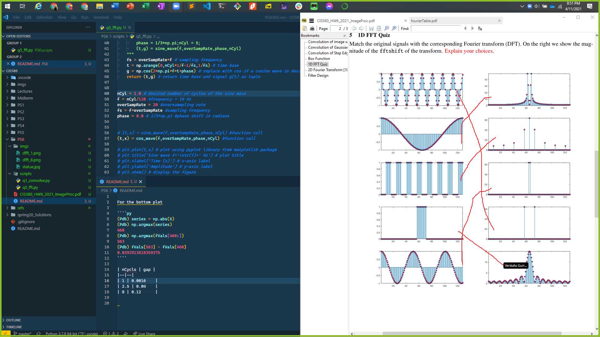
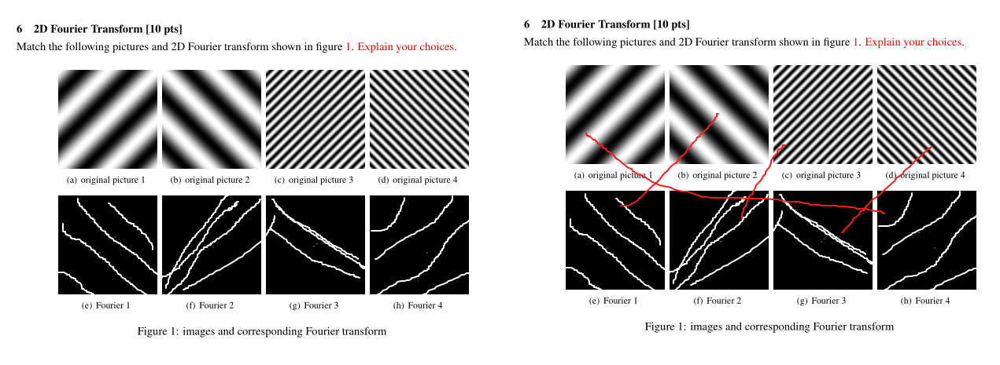

# CIS580 P-Set 6

## Q5 Matching

### Cosine functions

| cycles | gap |
|--|--|
| 8     | 0.12      |
| 2.5   | 0.04      |
| 1     | 0.0016    |

### Box Wave functions

- 8 box plot matches with 2nd from the top
- 1 box plot matches the single peak one similar to the 8 plot

### [Python Source](https://www.gaussianwaves.com/2020/01/how-to-plot-fft-in-python-fft-of-basic-signals-sine-and-cosine-waves/)

## Q6 Matching

