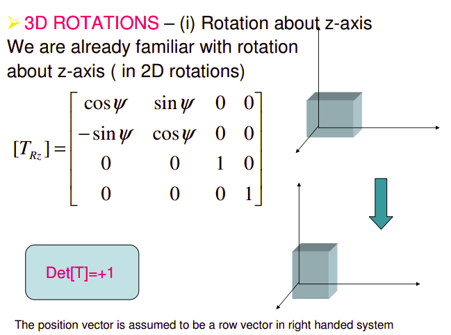
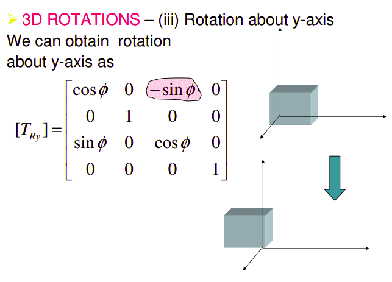
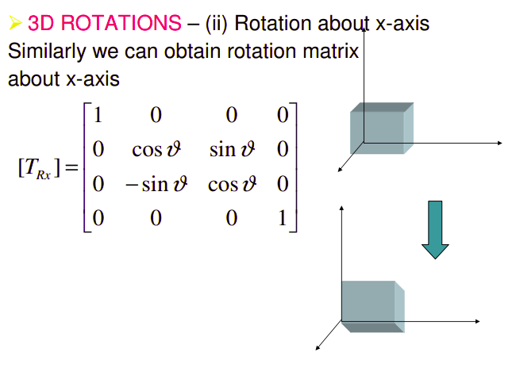

# CIS580, Spring 2021

Sheil Sarda

Taught by Prof. Kostas Daniilidis

## [Definitions of Image Projection](http://www.close-range.com/docs/Image_Projection-CSC420--Jepson2011.pdf)

## General Forms of 3D Rotations

### Rotation about z-axis

### Rotation about y-axis

### Rotation about x-axis

### [Other 3D Transformations](https://web.iitd.ac.in/~hegde/cad/lecture/L6_3dtrans.pdf)

